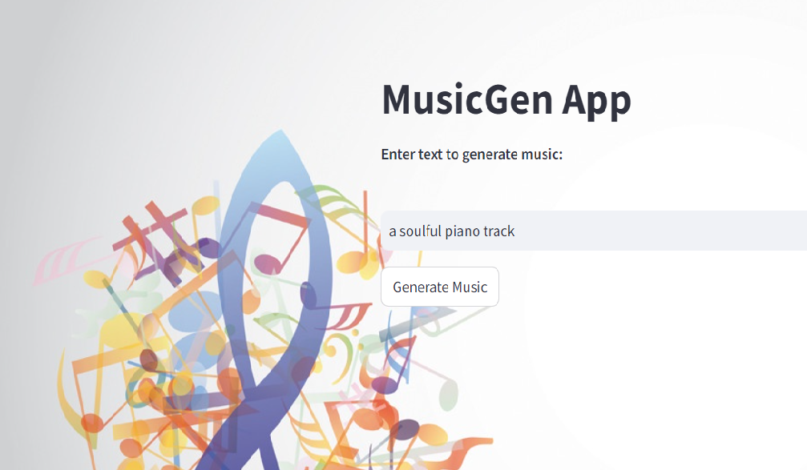

# Music-Generator-Application

**Description:**

This is a Streamlit application to generate music from user text using 'facebook/musicgen-small' model from HuggingFace library.

1. Create virtual environment with python=3.10
 conda create -n musicgen python=3.10 -y

2. Set HUGGINGFACE_API_KEY in .env file
3. pip install -r requirements.txt
4. streamlit run app.py